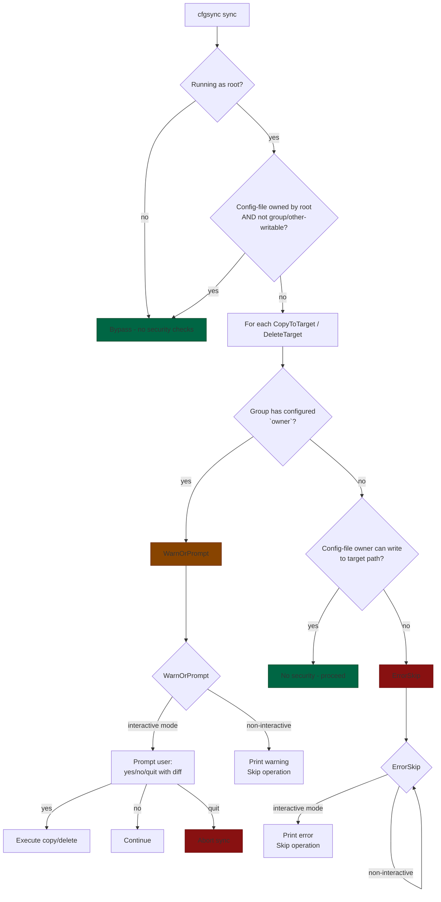

# Security model

When cfgsync runs as **root**, it can write files with ownership different from the config file owner — a privilege
escalation. The security model prevents an untrusted config file from exploiting this.

There are two levels of response, depending on whether the sync group has an `owner` configured:

**Groups with `owner` configured** (chown will happen): always requires confirmation, because changing file ownership
is inherently a privilege escalation. In interactive mode (`-i`), the prompt shows a unified diff:

```
=== Security: privileged write: etc/nginx/nginx.conf ===
@@ -1,5 +1,5 @@
-(file missing)
+server { ... }
...

[y]es [n]o [q]uit:
```

In **non-interactive** mode, a warning is printed and the operation is skipped.

**Groups without `owner`** (no chown): only triggers when the config file owner lacks Unix write permission to the
target path (simulating what `cp`/`rm` would allow). No prompt — an error is printed and the file is skipped:

```
Error: cannot copy 'file.txt' to target (config file owner lacks write permission)
```

**Hooks**: when a group's `owner` differs from the config file owner, the hook also requires confirmation:

```
=== Security: privileged hook execution ===
  hook: systemctl reload nginx

[y]es [n]o [q]uit:
```

- `y` — proceed with this operation.
- `n` — skip this operation (no changes made).
- `q` — abort the entire sync.

The security check is **bypassed** only when the config file is:
- Owned by root (uid 0), **and**
- Not writable by group or other (mode `0o022` bits clear).

This means a config file like `root:root 0755` skips all checks, but `root:root 0664` (group-writable) still triggers
them.

## Decision tree



## Scenarios

### 1. Root-owned config, not group/other-writable

```toml
# config.toml — owned by root:root, mode 0755
[[sync]]
source = "./dotfiles"
target = "/"
owner = "root:root"
globs = ["etc/nginx/**"]
hooks = { after = "systemctl reload nginx" }
```

| Condition | Value |
|---|---|
| Running as root? | yes |
| Config file root-owned + exclusive? | yes (0755 = no group/other write) |

**Result**: bypass — no security checks. File operations and hooks run normally.

---

### 2. Non-root config, group with configured owner

```toml
# config.toml — owned by user:user
[[sync]]
source = "./dotfiles"
target = "/"
owner = "root:root"
globs = ["etc/nginx/**"]
```

| Condition | Value |
|---|---|
| Running as root? | yes |
| Config file root-owned + exclusive? | no (user-owned) |
| Group has configured owner? | yes (`root:root`) |

**Result**: **WarnOrPrompt**. Changing ownership to root is always a privilege escalation.

- **Interactive (`-i`)**: shows unified diff, prompts `[y]es [n]o [q]uit`
- **Non-interactive**: prints warning and skips

```
=== Security: privileged write: etc/nginx/nginx.conf ===
@@ -1,5 +1,5 @@
-(file missing)
+server { ... }
...

[y]es [n]o [q]uit:
```

---

### 3. Non-root config, no configured owner, target not writable

```toml
# config.toml — owned by user:user
# Target /etc owned by root:root 0755
[[sync]]
source = "./dotfiles"
target = "/etc"
globs = ["**/*.conf"]
```

| Condition | Value |
|---|---|
| Running as root? | yes |
| Config file root-owned + exclusive? | no (user-owned) |
| Group has configured owner? | no |
| Config-file owner can write to target? | no (`/etc` root:root 0755 → other has no write) |

**Result**: **ErrorSkip**. The config-file owner (user) cannot write to `/etc`. No prompt — immediate error.

```
Error: cannot copy 'nginx.conf' to target (config file owner lacks write permission)
```

---

### 4. Non-root config, no configured owner, target writable

```toml
# config.toml — owned by user:user
# Target ~ owned by user:user 0755
[[sync]]
source = "./dotfiles"
target = "~"
globs = [".zshrc"]
```

| Condition | Value |
|---|---|
| Group has configured owner? | no |
| Config-file owner can write to target? | yes (`~` owned by user → owner write set) |

**Result**: **no security**. The config-file owner could do this without root. Sync proceeds normally.

---

### 5. Group-writable root-owned config

```toml
# config.toml — owned by root:root, mode 0664
[[sync]]
source = "./dotfiles"
target = "/etc"
globs = ["**/*.conf"]
```

| Condition | Value |
|---|---|
| Running as root? | yes |
| Config file root-owned + exclusive? | **no** (0664 has group write) |
| Group has configured owner? | no |

**Result**: same as scenario 3 or 4 (permission-based). The bypass fails because someone in the root group
could have modified the config.

---

### 6. Hook with different configured owner

```toml
# config.toml — owned by user:user
[[sync]]
source = "./dotfiles"
target = "~"
owner = "root:root"
hooks = { after = "systemctl --user reload" }
globs = [".config/**"]
```

| Condition | Value |
|---|---|
| Configured owner | `root:root` |
| Config-file owner | `user` |
| Owners differ? | yes |

**Result**: hook prompts in interactive mode, warns + skips in non-interactive.

```
=== Security: privileged hook execution ===
  hook: systemctl --user reload

[y]es [n]o [q]uit:
```

If the group had no `owner` (or configured owner matches config-file owner), the hook runs without security.
